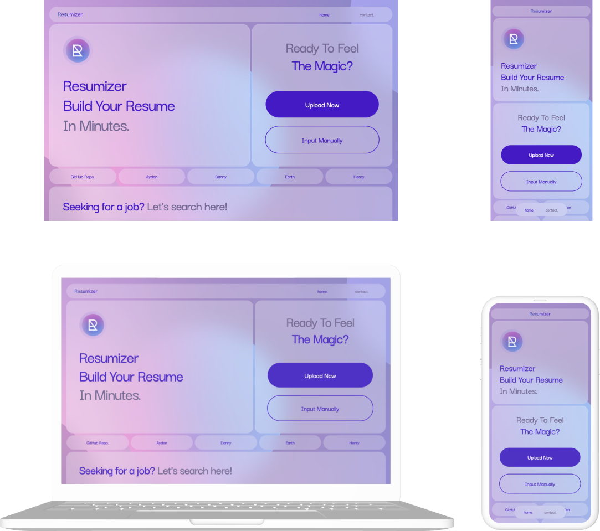
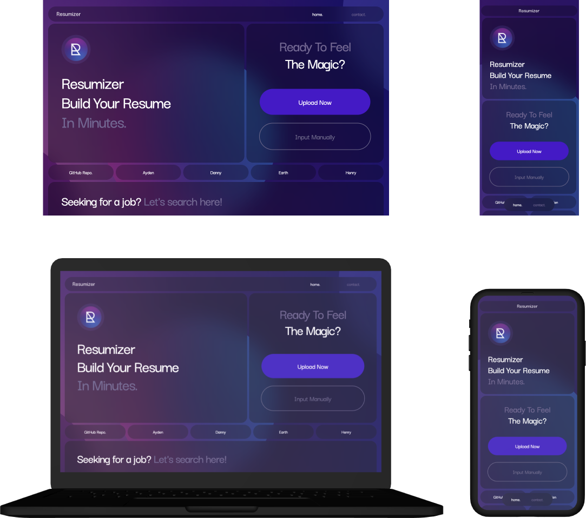

# Resumiser - Efficient AI Resume Builder

## Team Members
- [Ayden - Resumizer](https://github.com/Resumizer) - branch: ayden
- [Danny - dcapua](https://github.com/dcapua) - branch: danny
- [Earth - earthcha](https://github.com/earthcha) - branch: earth
- [Henry - phhoang98a](https://github.com/phhoang98a) - branch: henry

## Features
* Build your resume with AI

## Latest Demo Mockups
### Sprint 2
- Design: https://www.figma.com/file/m1DXq5G9wP9tpF1SeZoF5d/Resumizer?type=design&node-id=204%3A111&mode=design&t=ofxu7vmKRs0PRRI2-1
#### Update 02/09/2024
##### Light Mode Design (Visual Desgin Live Demo Edition 1)

##### Dark Mode Design (Visual Desgin Live Demo Edition 1)



## Front-End
_**Tech stack**_

* React
* Tailwind CSS
 
_**Setup**_

1. Clone the repository
2. Type `cd frontend` in terminal
3. Install the dependencies by running `npm install` (NodeJS is a prerequisite)
4. Start the development server by running `npm run dev`
5. Open `http://localhost:5173` in your browser

## Back-end
### Job Server
_**Setup**_

1. cd `/backend/JobServer`
2. Install the dependencies by running `pip install -r requirements.txt`
3. Start the development server by running `flask run`

_**Apis**_
```yml
POST - https://job-server-0wyb.onrender.com/jobs

Body(JSON): 
- "job_title": Title of the job (Software engineer)
- "country": Country of job posts
- "location": Specific location (optional)

Use the exact name, * indicates support for Glassdoor:

|                      |              |            |                |
|----------------------|--------------|------------|----------------|
| Argentina            | Australia*   | Austria*   | Bahrain        |
| Belgium*             | Brazil*      | Canada*    | Chile          |
| China                | Colombia     | Costa Rica | Czech Republic |
| Denmark              | Ecuador      | Egypt      | Finland        |
| France*              | Germany*     | Greece     | Hong Kong*     |
| Hungary              | India*       | Indonesia  | Ireland*       |
| Israel               | Italy*       | Japan      | Kuwait         |
| Luxembourg           | Malaysia     | Mexico*    | Morocco        |
| Netherlands*         | New Zealand* | Nigeria    | Norway         |
| Oman                 | Pakistan     | Panama     | Peru           |
| Philippines          | Poland       | Portugal   | Qatar          |
| Romania              | Saudi Arabia | Singapore* | South Africa   |
| South Korea          | Spain*       | Sweden     | Switzerland*   |
| Taiwan               | Thailand     | Turkey     | Ukraine        |
| United Arab Emirates | UK*          | USA*       | Uruguay        |
| Venezuela            | Vietnam      |            |                |


Result: List of job information about company, title, date_posted, job_url, location, site
```


### Resume Server
_**Setup**_

1. cd `/backend/ResumeServer`
2. Install the dependencies by running `npm install`
3. Start the development server by running `npm start`

_**Apis**_
```yml
POST - https://tiny-teal-swordfish-cap.cyclic.app

Body(form-data): 
- resume (File): PDF file
- jobTitle (text)
- openAIkey (text) 

Result: The new content of the resume.
```


## Database
* TBD

## API
* OpenAI API - GPT


